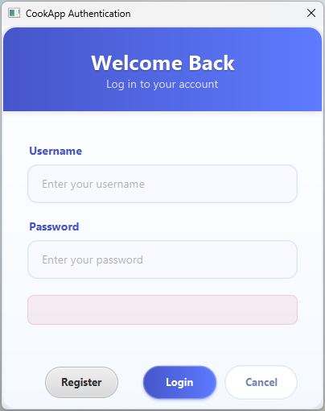
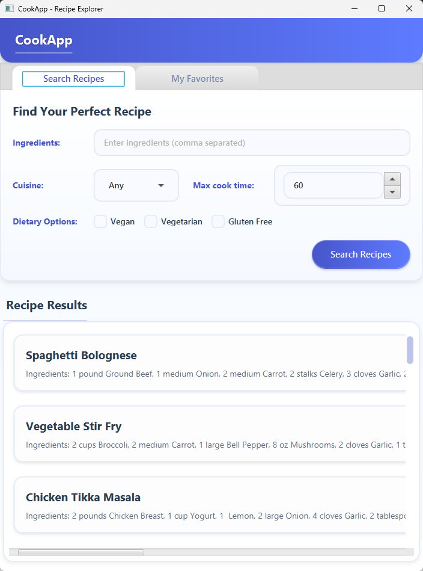
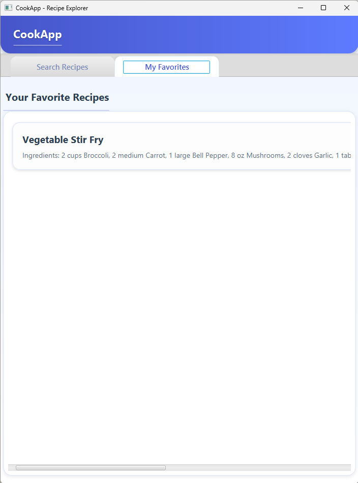
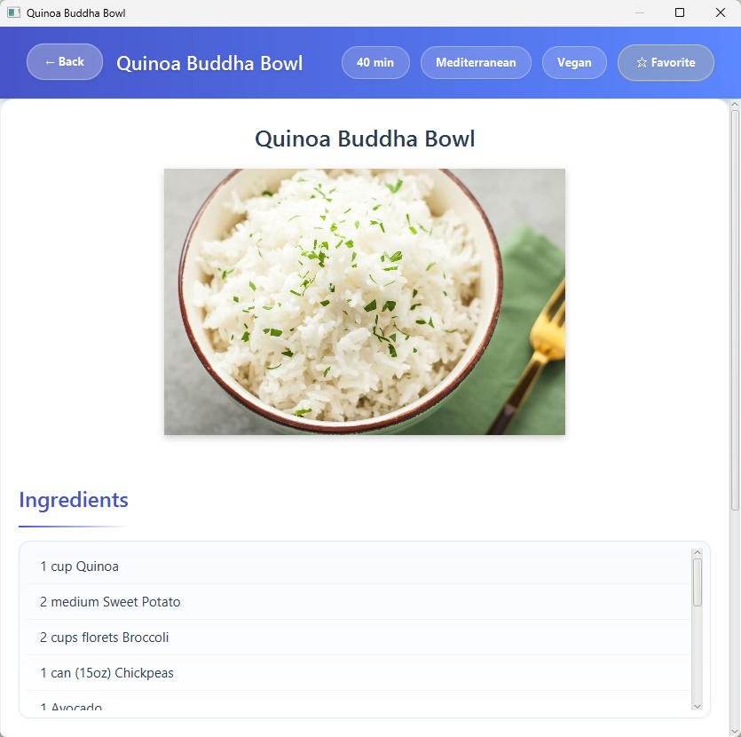

# CookApp - Recipe Management Application

CookApp is a JavaFX application that helps users discover, manage, and favorite recipes based on ingredients they have, dietary preferences, and cuisine types. The application provides an intuitive interface for searching recipes and maintaining a personal collection of favorite recipes.







## Features

- **User Authentication**
  - Secure login with password hashing (BCrypt)
  - User registration
  - Role-based access (Admin/User)

- **Recipe Management**
  - Browse comprehensive recipe database
  - View detailed recipe information including ingredients, instructions, cooking time
  - Filter recipes by:
    - Available ingredients
    - Cuisine type
    - Maximum cooking time
    - Dietary restrictions (Vegan, Vegetarian, Gluten-Free)

- **Personalization**
  - Save favorite recipes
  - View all favorites in a dedicated tab

## Technology Stack

- **Frontend**: JavaFX with FXML for UI layout
- **Backend**: Java 21
- **Database**: MySQL with Hibernate ORM
- **Build Tool**: Maven
- **Security**: BCrypt for password hashing

## Installation Instructions

### Prerequisites

- Java Development Kit (JDK) 21 or higher
- MySQL Server 8.0 or higher
- Maven 3.8 or higher
- Git (optional, for cloning the repository)

### Database Setup

1. Create a new MySQL database called `cookapp_db`:
   ```sql
   CREATE DATABASE cookapp_db;
   ```

2. Create a database user (or use an existing one) with permissions to access the database.

### Environment Configuration

1. Create a `.env` file in the project root directory with the following content:
   ```
   DB_USER=yourDatabaseUsername
   DB_PASS=yourDatabasePassword
   ```

### Build Instructions

1. Clone the repository (or download and extract the ZIP file):
   ```bash
   git clone https://github.com/ferrin-y/cookapp.git
   cd cookapp
   ```

2. Build the project using Maven:
   ```bash
   mvn clean package
   ```

### Running the Application

Run the application using the Maven JavaFX plugin:
```bash
mvn javafx:run
```

Alternatively, you can run the JAR file directly:
```bash
java -jar target/cooking-suggestion-app-1.0-SNAPSHOT.jar
```

## Usage Guide

### Login

1. When you first run the application, a login dialog will appear
2. Use the default admin credentials:
   - Username: `admin`
   - Password: `admin123`
3. Or register a new user account by clicking the "Register" button

### Finding Recipes

1. The main screen displays the recipe search interface
2. Enter ingredients you have (comma-separated)
3. Select cuisine type from the dropdown
4. Specify maximum cooking time
5. Check any dietary restrictions (Vegan, Vegetarian, Gluten-Free)
6. Click "Search Recipes" to display matching recipes

### Managing Favorites

1. Click on a recipe from the search results to view its details
2. Use the "★ Favorite" button to add/remove the recipe from your favorites
3. View all your favorite recipes in the "My Favorites" tab

## Project Structure

```
cookapp/
├── src/
│   └── main/
│       ├── java/
│       │   └── com/
│       │       └── ferrin/
│       │           └── cookapp/
│       │               ├── dao/           # Data Access Objects
│       │               ├── model/         # Entity classes
│       │               ├── service/       # Business logic
│       │               ├── ui/            # UI controllers
│       │               ├── util/          # Utility classes
│       │               └── Main.java      # Application entry point
│       └── resources/
│           ├── styles/                    # CSS stylesheets
│           └── *.fxml                     # JavaFX layout files
└── pom.xml                                # Maven configuration
```

## Database Schema

The application uses a relational database with the following main entities:

- **User**: Stores user accounts and authentication information
- **Recipe**: Contains recipe details including name, instructions, cooking time
- **Ingredient**: Represents individual ingredients
- **Quantity**: Associates ingredients with recipes, including amount and unit

## Development

### Requirements

- JDK 21
- MySQL Database
- Maven for dependency management
- IDE with JavaFX support (IntelliJ IDEA, Eclipse, etc.)

### Setting Up Development Environment

1. Import the project as a Maven project in your IDE
2. Configure the `.env` file with your database credentials
3. Run the `Main.java` class

## License

This project is licensed under the MIT License - see the LICENSE file for details.

## Acknowledgments

- JavaFX framework
- Hibernate ORM
- BCrypt for secure password hashing
- MySQL database
